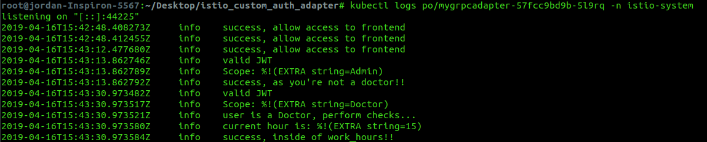

## Deployment Diagram


## Short Description Of Project:

Leveraging Istio to enforce rules-based authorization / entitlements between micro-services in a health application.

- 4 Python micro-services.
- 1 MongoDB micro-service.
- 1 Go micro-service to extend Istio's current functionality and allow me to add my own rules.

Python Services are written using Flask framework.

Services are wrapped in Docker, and deployed on Kubernetes.

Tokens are issued via one of 3 Auth0 API's I have created depending on the role of the user that logs in and is then sent to one of my Flask back-ends where it is sent to the front-end where it is stored and propagated to the other services to authenticate.

Deployed on Google Kubernetes Engine (GKE).

This app is designed to be run in Kubernetes, but you could also run using Docker compose, however, you will lose the functionality of Kubernetes and Istio.

## Technologies used:
- Python
- Flask
- Go
- Docker
- Kubernetes
- Istio
- JWT
- Auth0
- Shell scripting
- YAML
- Grafana
- Prometheus
- Google cloud (google kubernetes engine)
- Minikube
- Docker-compose

## Lifecycle Of A Doctor Logging In [Successful Scenario]


# Deployment
## Google Kubernetes Engine
1. visit https://console.cloud.google.com/projectselector/kubernetes and create a project or select one if already created. You will get roughly $260 worth of credits when you sign up and add your credit card, but don't worry, you will not be charged after you run out of credits unless you give your permission. The cluster lasts roughly a month before you need to pay or else it will just shutdown.

2. Choose create cluster. Or if not presented with the option, go to Kubernetes Engine on the left and then you should be presented with the option to create a cluster (you may have to wait a few minutes for google to enable some API's in the background, so hang tight).

3. When choosing the configuration for your cluster, leave all the options default besides number of nodes, region, and machine type. Change region to the nearest to you (e.g. europe-west2-a), number of nodes to 4, and machine type to 2 vCPU's. You can now create your cluster.

4. You will now need to make sure you have gcloud installed on your machine to continue. You can do so by viewing https://cloud.google.com/sdk/install.

5. Open up the command prompt on your local machine and run the command `gcloud auth list`, make sure the account in which you created the project with looks like `*       x0130180@gmail.com`. If it is not then you can change your toggled account by using `gcloud config set account <ACCOUNT>`. If you need to login to your account: run the command `gcloud auth login` and login via the link it presents you with. Your account should now be listed if you run `gcloud auth list` again.

6. You will now need to set your project to the one you previously created the cluster on. Run `gcloud projects list` to view all your projects associated with your account. Select your project with 
    ```bash
    gcloud config set project `PROJECT NAME`
    ```

7. Install kubectl 
    ```bash
    gcloud components install kubectl
    ```

8. Set compute zone (this should correspond to the region you chose when creating your cluster, if you set it wrong it will give you an error later and suggest which region you might have meant to set instead. So just set it again with this region if you come across that error.) 
    ```bash
    gcloud config set compute/zone europe-west2-a
    ```

9. You should be able to view your cluster with the command 
    ```bash
    gcloud container clusters list
    ```

10. Get the credentials of your cluster so you can interact with it via the terminal, by running 
    ```bash
    gcloud container clusters get-credentials standard-cluster-1
    ``` 
    Substitute `standard-cluster-1` with whatever your cluster name is, that is just the default name.

11. You will need to create a cluster admin role otherwise you will receive errors, you can do this by running 
    ```bash
    kubectl create clusterrolebinding x0130180-cluster-admin-binding \
    --clusterrole=cluster-admin \
    --user=x0130180@gmail.com
    ```
    Replacing `x0130180` with your google account name of course.

12. Install the latest version of istio on your machine, you can do so at: https://istio.io/docs/setup/kubernetes/download/.

13. Install Istio and enable automatic sidecar injection on your cluster with the following commands:
    ```bash
    kubectl apply -f istio-1.0.6/install/kubernetes/helm/istio/templates/crds.yaml
    kubectl apply -f istio-1.0.6/install/kubernetes/istio-demo.yaml
    kubectl label namespace default istio-injection=enabled
    ```
    
    You should be able to now see that istio has deployed in the istio-system namespace. It should look similar to this, minus the mygrpcadapter pod as we haven't gotten to that yet...
    
    

14. You are finally ready to deploy the application, apply the yaml file
    ```bash
    kubectl apply -f Rules-based-auth/platform/kube/deployment.yaml
    ```
    You should be able to view your deployed pods via
    ```bash
    kubectl get pods
    ```
    You should see something like
    
    
    
15. Apply the egress so your cluster allows for outgoing traffic to your Auth0 API so your application can retrieve the JWT.
    ```bash
    kubectl apply -f Rules-based-auth/networking/auth0-egress.yaml
    ```
    
16. Apply the ingess gateway that directs all the incoming traffic towards your service mesh
    ```bash
    kubectl apply -f Rules-based-auth/networking/rbac-gateway.yaml
    ```
    You will be able to view your services by opening the ingress gateway's external IP.
    ```bash
    kubectl get svc -n istio-system
    ```
    Just copy and paste the external IP of the ingress gateway pod into your web browser.
    
    In this case it would be 35.246.83.26
    
    
    
17. Apply the rbac policy that secures the backend and admin-backend services. Will enforce rule that you need a JWT that corresponds to this JWK's `https://jor2.eu.auth0.com/.well-known/jwks.json`.
    ```bash
    kubectl apply -f Rules-based-auth/security/rbac-policy.yaml
    ```
    
18. Enable rules based access control on the backend and admin-backend services.
    ```bash
    kubectl apply -f Rules-based-auth/security/rbac/enable-rbac.yaml
    ```
    
19. Create the admin role that grants access to all services once the scope of your decoded JWT token is Admin or Doctor.
    ```bash
    kubectl apply -f Rules-based-auth/security/rbac/admin-role.yaml
    ```
    
20. Create the regular user role that grants access to all services besides the admin-backend. All this user needs is a JWT token from my Auth0 API.
    ```bash
    kubectl apply -f Rules-based-auth/security/rbac/user-role.yaml
    ```
    
21. Extend Istio's current functionality and add a built in rule that enforces those with the scope of Doctor in their decoded JWT token, should only be able to access the backend and admin-backend during the times of 9am to 5pm (time depends on where server is deployed). Start by deploying the service in the Istio namespace via:
    ```bash
    kubectl apply -f Rules-based-auth/istio-custom-auth-adapter/cluster-service.yaml
    ```
    
22. Create templates for logs
    ```bash
    kubectl apply -f Rules-based-auth/istio-custom-auth-adapter/mygrpcadapter/testdata/template.yaml
    kubectl apply -f Rules-based-auth/istio-custom-auth-adapter/mygrpcadapter/testdata/attributes.yaml
    kubectl apply -f Rules-based-auth/istio-custom-auth-adapter/mygrpcadapter/testdata/mygrpcadapter.yaml
    ```
    
23. Apply the rule that limits Doctor's to 9-5
    ```bash
    kubectl apply -f Rules-based-auth/istio-custom-auth-adapter/mygrpcadapter/testdata/sample-operator-cfg.yaml
    ```
    
24. You should have everything now configured for your cluster. You can view the logs of your custom rule that extends Istio by viewing the logs of the pod.
    ```bash
    kubectl get pods -n istio-system
    kubectl logs po/mygrpcadapter-57fcc9bd9b-6bxp7 -n istio-system
    ```
    Just interchange `mygrpcadapter-57fcc9bd9b-6bxp7` for whatever the new name of the pod is.
    
    You should see something like this
    
    

Site is currently visible at: < insert ingress IP >

This app is designed to be run in Kubernetes, but you could alternatively also run using Docker compose, however, you will lose the functionality of Kubernetes and Istio.
```bash
docker-compose up --build
```

view frontend at http://localhost:8001/ after building app.

### Project Showcase
[](http://www.youtube.com/watch?v=oZF5WdPio6c)